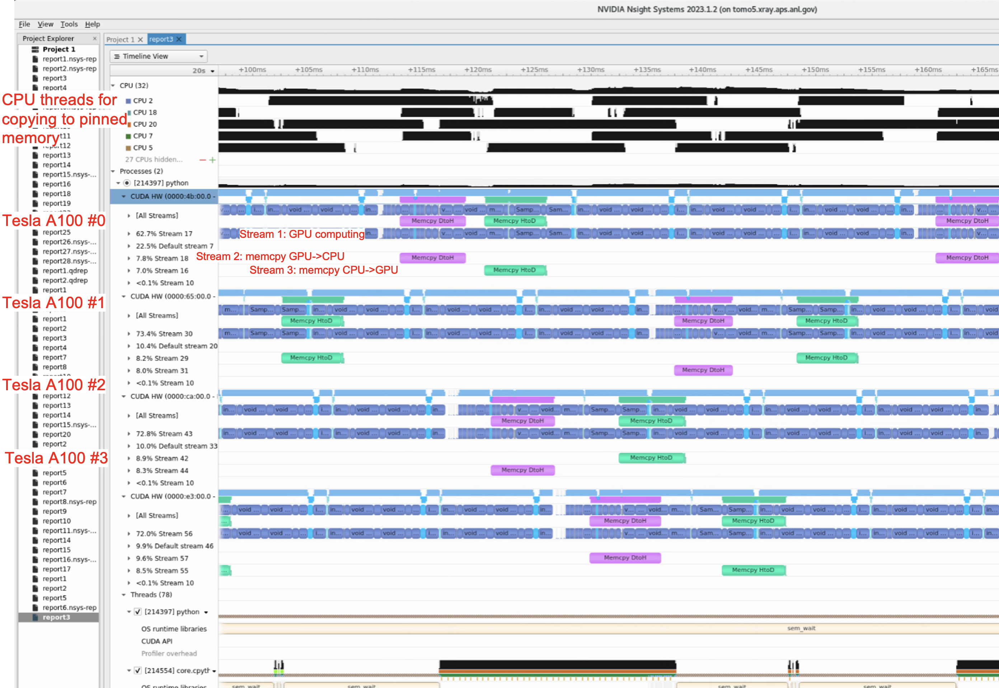

========
StreamTomocuPy
========

**StreamTomocuPy** is a Python package for GPU reconstruction of tomographic data with pipeline data processing with Cuda streams and multi GPUs in 16-bit and 32-bit precision.

================
Installation
================

~~~~~~
Check CUDA path
~~~~~~
Example

::

   export CUDA_HOME=/usr/local/cuda-12.1
   export PATH=${CUDA_HOME}/bin:${PATH}
   export LD_LIBRARY_PATH=${CUDA_HOME}/lib64:$LD_LIBRARY_PATH

~~~~~~
Install necessary packages
~~~~~~

::

  conda create -n streamtomocupy cupy scikit-build swig cmake h5py pywavelets matplotlib notebook
  
  conda activate streamtomocupy

~~~~~~
Install streamtomocupy
~~~~~~

::
  
  git clone https://github.com/nikitinvv/streamtomocupy
  
  cd streamtomocupy
  
  pip install .
  
================
Tests
================

See tests/test.ipynb. Reconstruction parameters are set in tests.conf file.

================
Profiling with Nvidia Nsys
================
4x Tesla A100 HBM memory. Parameters args.nsino_per_chunk=16, args.nproj_per_chunk=16, args.reconstruction_algorithm='lprec', args.dtype='float16'

::

   nsys profile python test_2k.py

Opened with nsys-ui

 

