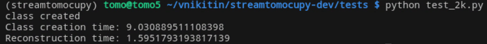

========
StreamTomocuPy
========

**StreamTomocuPy** is a Python package designed for GPU-accelerated reconstruction of tomographic data, leveraging CUDA streams and multi-GPU setups. It supports both 16-bit and 32-bit precision for efficient, high-performance processing.

While it inherits the core functionality of **TomocuPy**, **StreamTomocuPy** is specifically optimized for fast, streaming data processing, minimizing I/O operations with disk storage. The package’s streaming capabilities and multi-GPU parallelization are abstracted away using a decorator function, making it easy to adjust the code and add new processing functions as needed.

The key functionality is encapsulated in the *StreamRecon* class, located in the *streamrecon.py* module. This class is instantiated once and reused to process data of the same size, or subsets of the data. During the initial setup, the class allocates GPU and pinned memory buffers, output arrays, and initializes necessary methods. This setup may take approximately 10 seconds.

To test the functionality see *tests/test.ipynb*.

================
Installation
================

~~~~~~
Check CUDA path
~~~~~~
Example

::

   export CUDA_HOME=/usr/local/cuda-12.1
   export PATH=${CUDA_HOME}/bin:${PATH}
   export LD_LIBRARY_PATH=${CUDA_HOME}/lib64:$LD_LIBRARY_PATH

~~~~~~
Install necessary packages
~~~~~~

::

  conda create -n streamtomocupy cupy scikit-build swig cmake h5py pywavelets matplotlib notebook
  
  conda activate streamtomocupy

~~~~~~
Install streamtomocupy
~~~~~~

::
  
  git clone https://github.com/nikitinvv/streamtomocupy
  
  cd streamtomocupy
  
  pip install .
  
================
Tests
================

See tests/test.ipynb. Reconstruction parameters are set in tests.conf file.

================
Profiling with Nvidia Nsys
================
4x Tesla A100 HBM memory. Parameters args.nsino_per_chunk=16, args.nproj_per_chunk=16, args.reconstruction_algorithm='lprec', args.dtype='float16'

::

   nsys profile python test_2k.py

Opened with nsys-ui

.. image:: nsys.png
   :alt: Nsys
   :width: 1200px
 

Example of output

